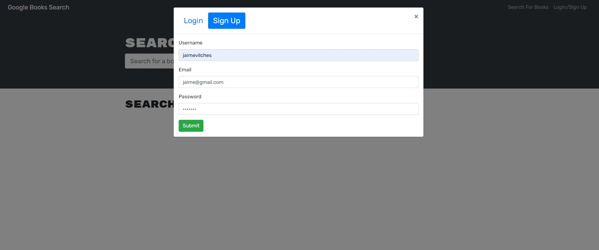
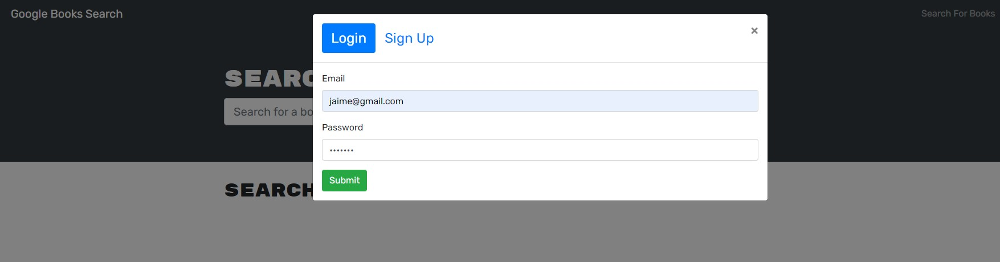
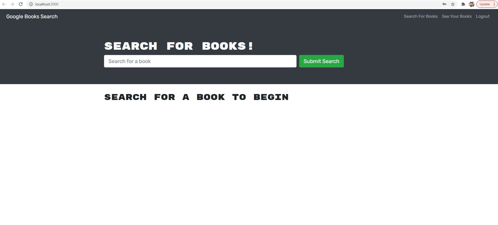
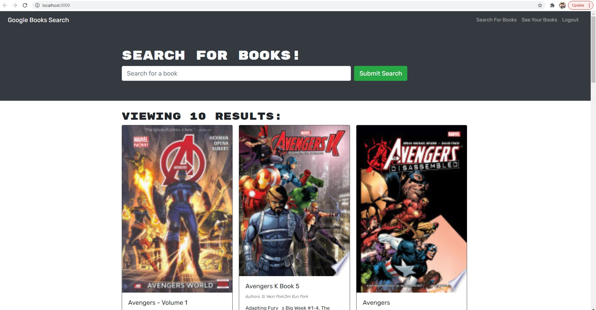
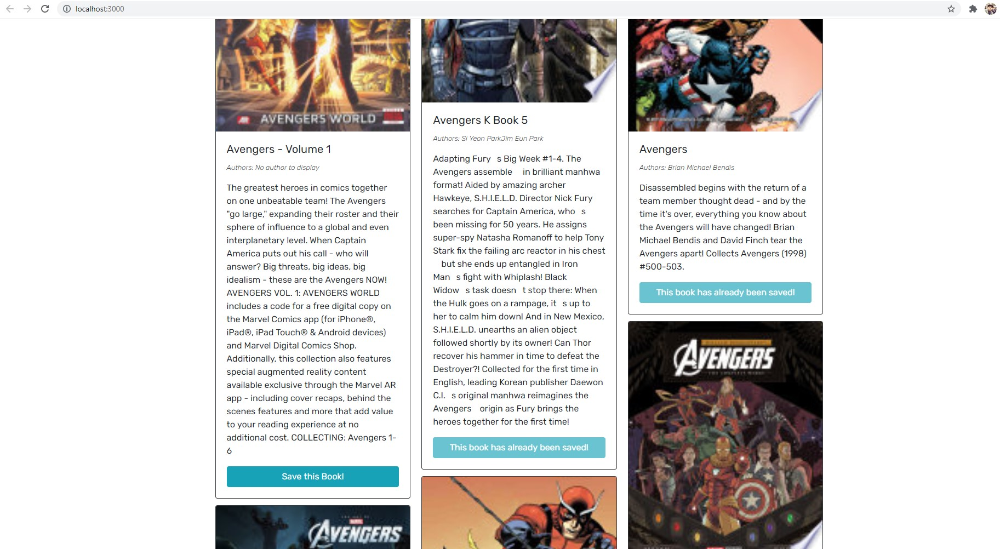

# Mern

1. [ Description. ](#desc)
2. [ Web Address. ](#web-address)
3. [ Usage tips. ](#usage)
4. [ Questions. ](#questions)

## 1. DESCRIPTION

A full stack MERN application that allows a user to search for books and save those books to a profile. The user also has the ability to remove the book from their saved books list.

## 2. How to Get There

Open your favorite web browser and enter the following web address to access repo.

https://github.com/JaimeVilches87/Mern.git
https://gentle-island-44090.herokuapp.com/

## 3. Usage Tips

Clone the repository and run npm install. After installation, npm run develop will start the application.

Testing the application  

#### SignUP

#### Login

#### Home

#### Search Book

#### Save Book

## 4. Questions

Any questions feel free to reach out to me!

Email: JaimeVilches87@gmail.com